# 牛马牌游戏

[](LICENSE)
[](https://godotengine.org/)
[](#4-构建打包测试)

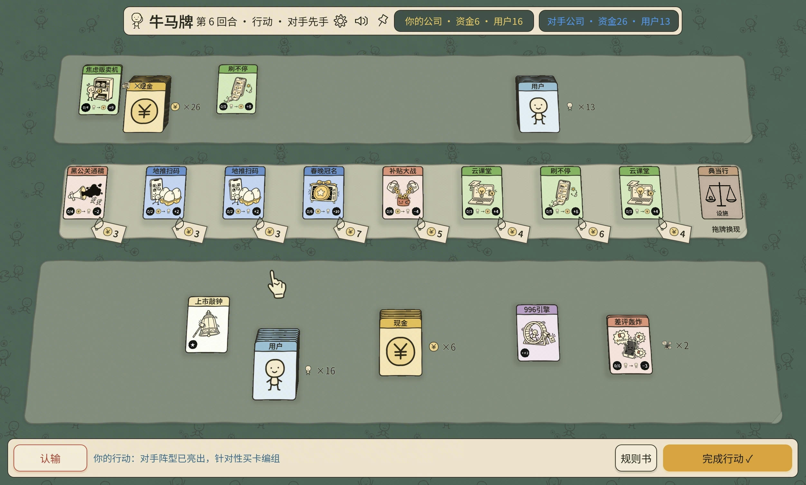

牛马题材的轻量卡牌对战游戏。玩家经营自己的公司，与 BOT 或另一名玩家争夺同一批市场卡牌，通过生产、升级、攻击和资源管理取得胜利。

本文记录设计思路、玩法规则、目录结构、构建与测试命令，以及使用许可。平衡分析和具体数值统一放在 [`balance.md`](balance.md)，运行时配置以 `data/` 下的 JSON 为准。

## 1. 基础的游戏设计思路

### 1.1 资源与决策

游戏只有两种基础资源：资金和用户。

- 资金是会被消耗的燃料：用于购买市场卡，也可能作为组合配方被消耗。
- 用户是留在组合中的席位：用户配方通常不会被消耗，组合成立后可持续产生收益。
- 同一批资源要在购买、生产、攻击和胜利进度之间分配，玩家每回合都要选择当前最重要的用途。

### 1.2 先组装、后兑现

一回合中的主要决策顺序是：观察市场、购买卡牌、编组、预判对手的攻击，再进入攻击和结算。组合在编组时只是摆出阵型，效果在后续阶段统一处理。

组合可以被攻击拆散；完成升级或形成带防御 Buff 的有效组合后，会进入更稳定的终局竞速。设计重点放在“成型前是否有选择和反制”，而不是在成型后继续增加复杂规则。

### 1.3 配置驱动

卡牌、组合配方、升级路线、市场权重、基础规则和 Buff 倍率均从配置读取：

- 卡牌规则：`data/cards.json`
- UI、配色、资源名称和音效：`data/ui.json`
- BOT 搜索与模拟参数：`data/bot.json`
- 平衡说明与评估口径：`balance.md`
- 单机自定义卡表：通过「选项 → 卡牌配置」选择完整的 `cards.json`，只允许修改数值字段；配置从下一局单机/BOT 对局生效。

## 2. 游戏玩法

### 2.1 胜利目标

一局游戏由两名玩家组成：`PLAYER` 与 `BOT`，联机时双方分别坐在两个座位。胜负条件由 `data/cards.json` 的 `_game` 段定义，包含资金胜利线、初始资源和资源名称。

达到资金胜利线、将对手资金降至零、或将对手用户降至零即可获胜；自己的资金或用户降至零则失败。主动购买、典当或结算不能把自己的资源直接降到失败状态，受到对手攻击则按正常失败处理。

### 2.2 回合流程

每回合按以下顺序执行：

1. **生成市场**：按照 `_game.market_size` 生成当回合公共卡位，未购买的卡不会自动保留到下一回合。
2. **行动阶段**：先手玩家完成购买和编组，后手玩家随后行动；后手可以看到先手已经摆出的阵型。
3. **自动整理**：未编组的单位卡自动归堆，组合中的卡保持自己的编组关系。
4. **攻击阶段**：攻击组合先装弹，再按攻击资源汇总成攻击池，由攻击方点选目标。
5. **结算阶段**：检查生产组合和升级组合是否仍然满足配方，满足后付款并产出。
6. **胜负检查**：若未结束则轮换先手，开始下一回合。

一张卡在同一回合只能参与一个组合；组合效果不会在行动阶段提前触发。

### 2.3 卡牌定义

每张卡由 `data/cards.json` 中的一个对象定义。常用字段如下：

| 字段 | 作用 |
|---|---|
| `name` | 显示名称 |
| `kind` | 卡牌类别：`unit`、`product`、`attack`、`buff`、`legend` |
| `tier` | 卡牌档位 |
| `price` | 市场购买价；不可购买或由升级产生的卡不单独写购买价 |
| `weight` | 市场生成权重 |
| `recipe_res` / `recipe_n` | 生产或攻击组合所需的单位资源类型与数量 |
| `output_res` / `output_n` | 生产组合产出的资源类型与数量 |
| `attack_res` / `attack_n` | 攻击组合可移除的资源类型与攻击量 |
| `upgrade_from` / `upgrade_dup_n` | 升级来源和材料份数；普通 T2 要求同名，传说接受同档任意生产卡，实际张数按路线折算 |
| `buff_type` | Buff 的行为类型 |
| `pawn` | 传说卡等特殊卡的典当值 |

卡牌对象前缀为 `_` 的键是规则段，不是可抽取卡牌。单位卡使用 `res` 标明资源类型；组合卡和 Buff 卡由 `kind` 与其余字段共同决定行为。

### 2.4 卡牌类别

- **单位卡**：资金、用户，是生产和攻击组合的基础材料。
- **生产卡**：与单位卡组合后产出资金、用户或其他卡牌。
- **攻击卡**：与单位卡组合后产生攻击点，移除对手对应类型的单位卡。
- **Buff 卡**：附着在生产或攻击组合上，改变配方填充、产出、攻击或保护效果。
- **传说卡**：由升级组合生成的终局筹码，不能作为生产或攻击发动机，也不能被攻击拆除，但可以典当。

### 2.5 购买与典当

购买市场卡需要支付资金卡，支付后的卡离开场面。购买价格读取卡牌的 `price` 字段，四种操作共用同一购买裁决与动画：

- 把现金拖到商品上。
- 点击商品旁的价格牌，由游戏自动选取可用现金付款。
- 把商品拖到已组好的纯现金摞上；优先使用所选这一摞付款；该摞金额不足时商品回到原位，成功后商品留在松手处，遮挡商品的余款保持成摞并就近挪开。
- 把商品直接拖到自己的理牌区，自动使用未编入有效产出、攻击组合的现金付款，成交后留在松手处。

两种自动付款入口都跳过有效产出、攻击组合中的全部现金；组合里的富余现金也不会被自动拆走。可用现金不足时不成交。拖到非现金牌或其他组合旁也按自动付款处理，只买入商品，不直接并入该组。

点击价格牌时按下后移开、长按查看、触摸取消或中断不会购买；商品拖出窗口后松手也会回到原位。商品尚未成交时仍属于购牌区，不能当作己方卡编组或典当。教程也支持这四种入口，实际购买目标由同一购买结果判定。

典当行是桌面上的固定公共设施：可以将用户卡和其他非现金卡拖入换取资金。典当公式由 `data/cards.json` 的 `_game.pawn_rate`、`_game.pawn_user` 和卡牌的 `pawn` 字段决定；现金卡不能典当。典当不允许把自己的用户或资金降到失败状态。

**典当行**：用户卡 1 现金/张；标价 ÷2；下级材料购牌价之和 ÷2；同名下级卡×2；独角兽 30；国民应用 70；上市敲钟 100。

### 2.6 组合与结算

生产和攻击组合只有一个核心卡，可附带单位卡和 Buff 卡；升级组合只放符合路线的生产卡。每张卡每回合只能属于一个组合。

| 组合类型 | 构成 | 结算行为 |
|---|---|---|
| 生产组合 | 一张 `product` + 配方单位卡 + 可选 Buff | 产出一种资源 |
| 攻击组合 | 一张 `attack` + 配方单位卡 + 可选 Buff | 生成攻击点 |
| 升级组合 | 张数准确、满足路线要求的同档生产卡 | 消耗全部材料，生成一张升级产物，不附带资金、用户或 Buff |
| 无效组合 | 缺少核心、配方不满足或混入不允许的卡 | 不参与结算 |

配方只使用一种单位资源；一个组合只产生一种结果。组合是否有效由 `engine/combo_rules.gd` 评估，结算时会再次检查，避免卡牌在攻击阶段被移除后仍然产出。

资金配方在结算时支付并离场；用户配方作为组合席位保留。若付款后会使己方资金归零，整组作废。生产组合按结算顺序处理，先处理不需要支付资金的组合，再处理需要支付资金的组合。

### 2.7 升级

升级是纯卡面合成，不消耗资金或用户。升级路线由 `data/cards.json` 的 `_upgrade.routes` 和每张卡的 `upgrade_from`、`upgrade_dup_n` 定义：

- 两张同名 T1 仍按原路线合成对应 T2。
- 传说合成只要求材料为同档生产卡，卡名可以相同，也可以不同。T1 与 T2 不能混用。

| 传说产物 | 任意 T1 生产卡 | 任意 T2 生产卡 |
|---|---:|---:|
| 独角兽 | 恰好 4 张 | 恰好 2 张 |
| 国民应用 | 恰好 6 张 | 恰好 3 张 |
| 上市敲钟 | 恰好 8 张 | 恰好 4 张 |

少放、多放，或混入资源卡、Buff、攻击卡、传说卡，均不成立；不会自动从一堆材料中挑出子集升级。传说卡只作为升级结果或典当对象，不参与生产、攻击或后续升级。

升级目标及张数读取 `cards.json`；游戏、BOT、模拟与界面共用 `ComboRules` 的升级判定，精确张数始终是硬约束。

### 2.8 Buff

Buff 是否生效由 `buff_type` 决定，倍率和行为参数由 `_game.buff_mult` 等配置提供。当前行为类别包括：

- `user_fill`：满足条件时降低用户配方的实际填充要求。
- `output_x2`：使生产产出按配置倍率计算。
- `attack_x2`：使攻击量按配置倍率计算。
- `protect_user`：保护组合所需的用户配方卡。
- `protect_cash`：保护组合所需的资金配方卡。

Buff 必须和一个有效核心组合在同一组中才会生效；保护额度只覆盖配方需要的单位卡，富余单位卡仍可被攻击。

同一组中的数值 Buff 按张数叠乘：默认倍率下，两张 996 引擎使产出变为 4 倍，三张为 8 倍；热搜包年同理叠乘攻击量。两类倍率互不混用。裂变补满和资源保护属于状态，多张不会重复扩大其效果；同一张实体卡不能重复计数。

### 2.9 攻击

攻击阶段先为攻击组合装弹，再把攻击量按目标资源汇总成攻击池。攻击池只能攻击对应类型的单位卡：

- 散牌、组合中的富余单位卡和配方单位卡都可以成为目标。
- 移除配方所需的任意一张单位卡，可能使整个组合在结算时失效。
- 受保护的配方单位卡、组合核心、Buff 卡和传说卡不能被直接攻击。
- 一旦开始攻击某个组合，剩余攻击点会锁定在该组合上；攻击点不足以继续选择目标时结束。
- 攻击把对手资金或用户降至零时立即结束并判胜。

攻击目标、攻击锁和攻击结果由 `GameState`、`ComboRules` 与 `engine/settle.gd` 共同维护，界面、BOT、模拟器和联网服务器使用同一套规则。

### 2.10 自定义卡表、BOT、录像与联机

「选项 → 卡牌配置」可以点击选择，或直接把 `cards.json` 从文件管理器拖到拖放区域。它必须与默认卡表保持相同的卡牌集合、卡牌语义、升级路线、Buff、胜负条件和固定规则，只能改变允许的数值字段。选择后不会修改当前对局，点击“应用并重开”后从下一局单机或 BOT 对局生效；配置路径保存在本地用户偏好中。

旧卡表里的 `_comment`、`_note` 说明文字不会影响兼容性；实际规则字段仍严格校验。旧配置也使用当前游戏规则，因此更新升级规则后需要重新评估，历史结果不会改写。

可编辑字段、数值边界和固定规则由 `data/card_config_schema.json` 声明；游戏与无头评估共用 `engine/card_config_rules.gd`，Python 工作台读取同一规格，共享契约样例验证三个入口。每次开局重新校验选中的文件。

手动调参网页的“导出 cards.json…”直接输出完整卡表，可选择项目的 `data/cards.json` 进行替换。工作台保存的 `reports/manual_balance/configs/<配置ID>.json` 也使用同一纯卡表格式；版本名称等信息另存在 `config_meta/`，备注和评估按原配置 ID 关联。旧封装文件会在工作台启动时转换，卡牌参数保持不变。

桌面启动可传 `--cards-config=/absolute/path/cards.json`（含空格的路径将整个参数用引号包住）。它在本次进程中优先于已保存的卡表选择，单机重开仍使用指定文件，不改用户偏好；路径或内容无效时明确报错。手动调参网页的“保存并以当前配置启动游戏”会先保存当前配置及备注，再保存卡表快照并使用此参数打开游戏，试玩不新增评估记录。出售价格使用卡牌的 `pawn` 字段，可填非负整数；未设置的卡牌继续沿用游戏原有计算规则。

联网对局始终使用内置 `res://data/cards.json`。当前单机局若用了自定义卡表，需要先恢复默认并重开，才能建立或加入房间；等待对手期间保留原局规则。联网和录像播放期间“卡牌配置”页会锁定，录像需先退出再开始新局。


BOT 当前实现由 `data/bot.json` 选择模型和搜索强度，策略实现位于 `engine/bot_*.gd`。BOT 通过与真人相同的购买、编组、攻击和结算接口行动。

录像保存行动和规则指纹，可在游戏内回放；回放使用正式对局的结算和动画路径。底栏可输入行动步数并按回车或点击“跳转”，范围为 0～总行动步数，0 表示初始局面；计数与“上一步／下一步”一致，同一摞连续攻击算一步。每次保存使用独立文件名，已有录像不会被同名保存覆盖。配置偏好通过临时文件完整写入后替换，保存失败会明确提示并保留原选择。

网络规则指纹包括卡牌、游戏规则和升级规则；旧录像只有保存的完整规则一致时才迁移旧指纹。

联机恢复使用独立于动画展示状态的服务器检查点，包含同一版本的快照、阶段、行动方和序号；重连按当前阶段继续，主机接管保留已经确认的结算进度。当前协议版本为 10，双方需使用同版本构建；该版本统一对手座位标识为 bot，并沿用同类数值 Buff 按张数叠乘的规则。

### 2.11 怎么玩、教程与卡牌总览

底栏「怎么玩」提供教程、卡牌总览和升级关系，不再设置规则速查页。首次展开牌桌显示“第一次玩牛马牌？”，可选择“带我上手”或“直接开局”；选择后不再反复邀请。教程列表直接显示全部课程名称与学习记录，点选课程即开始；每一步目标由牌桌小人随着操作给出。

首次引导先带玩家完成买牌、拆用户、配牌、结算、查看收入五步，再连续进入后续课程。选课后直接回到原牌桌，App 图标小人只显示一句当前目标和退出入口；普通买牌、拆牌和配牌完成后直接显示下一项操作；遇到结算、攻击等关键结果或进入下一课时，保留现场，等玩家点小人或对白继续。玩家没有操作时，当前目标保持不变。课程之间由小人连续带教，结果说明点小人继续，不必反复打开「怎么玩」。教学中底栏在「怎么玩」旁显示「结束教程」，也可以通过小人旁的退出按钮或 Esc 随时结束。打开课程列表或图鉴只暂停教学，关闭后继续当前进度。

**教程故事线**

故事从“让公司赚到第一笔钱”开始，逐步引出扩张、竞争、升级、变现与经营取舍，最后由玩家独立完成经营。当前共 8 门课、42 个步骤，下面的箭头表示默认连续教学顺序；全部课程在列表中直接展开，可任选一课开始并继续后面的课程，没有前置解锁要求。每课使用自己的练习局面，部分课程内部也会切换局面，不继承上一课的经营资产；切课仍使用同一张牌桌和同一个小人。

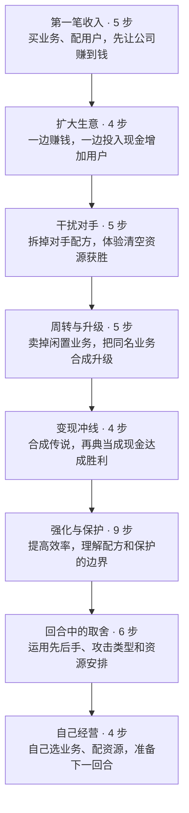

**首次上手：从第一个回合连续教下去**

每个编号节点都是玩家当前要完成的目标，直接说明拖哪张牌、拖到哪里或点击哪个按钮；不只描述希望得到的结果。配组步骤只要求把材料拖叠在一起，实际合成在后续点击「完成行动」时发生。买牌、拆用户和配牌完成后直接衔接下一项操作，配好牌即可点击原「完成行动」，无需先点对白。第一回合产出完整演出后，保留结果牌桌并显示“点我继续教程：扩大生意”，点击才进入下一课，标题直接读取课程配置。点小人或对话框都能继续，拖动小人只移动提示。完整教学结束或玩家主动终止时，才恢复进入教程前的原局。

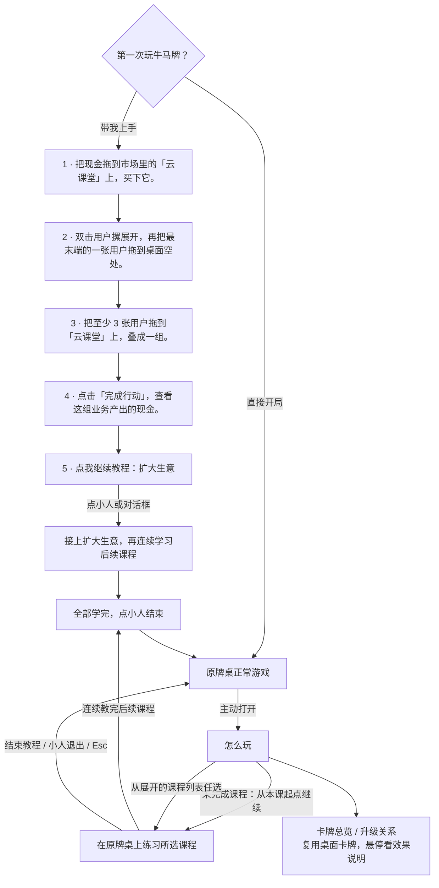

以下列出其余 7 门课的全部步骤。普通准备步骤在实际操作与演出结束后衔接下一项操作；攻击、生产、升级、保护对照等关键结果与课末需要点小人或对白继续。图中不另增确认节点。数值对应当前标准卡表，实际提示由课程配置和卡表展开。

**扩大生意 · 同时赚钱和拉新**

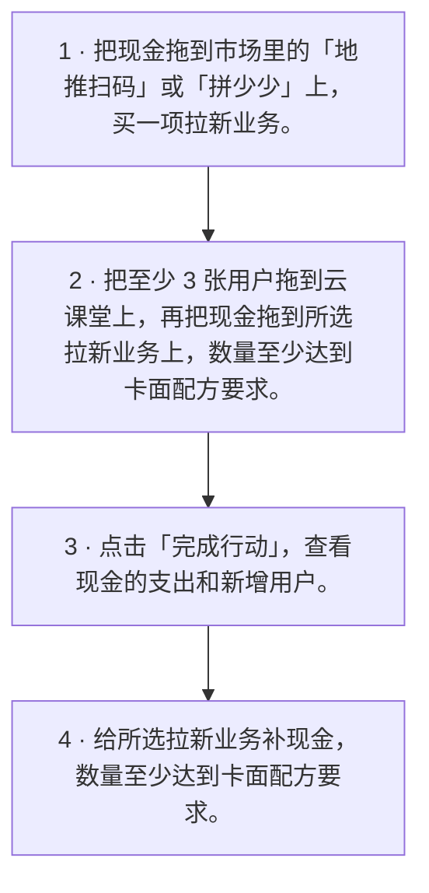


**干扰对手 · 从让业务停产到清空资源获胜**

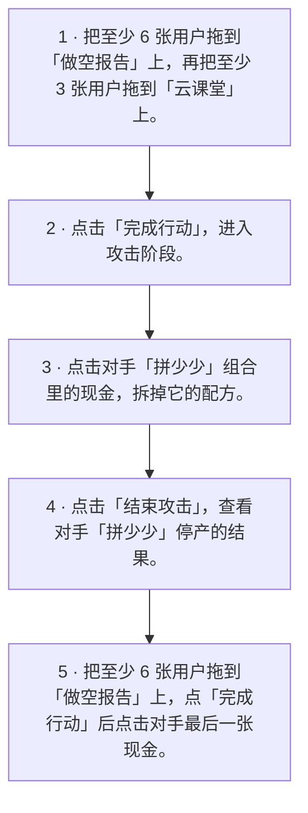


**周转与升级 · 闲置业务变现金，同名业务变强**

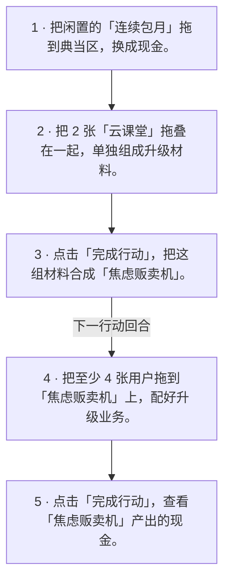


**变现冲线 · 合成独角兽，再把价值变成现金**

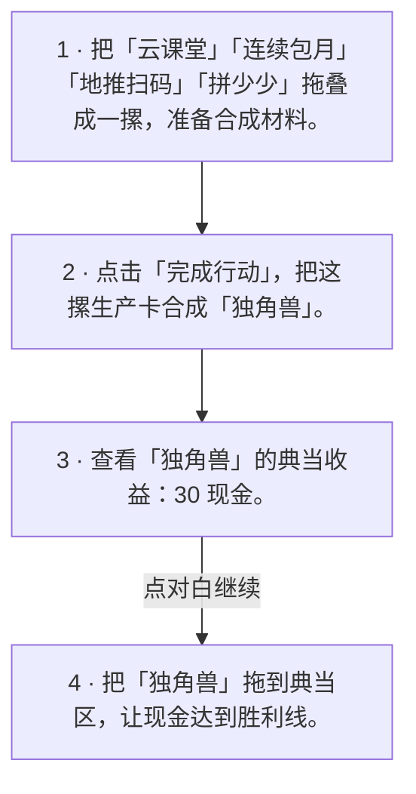


**强化与保护 · 先看到效果，再试出边界**

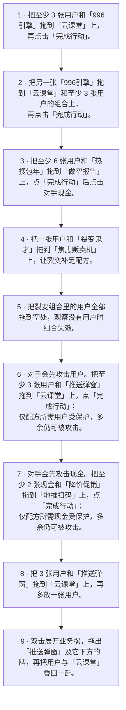


**回合中的取舍 · 读懂对手，再安排自己的行动**

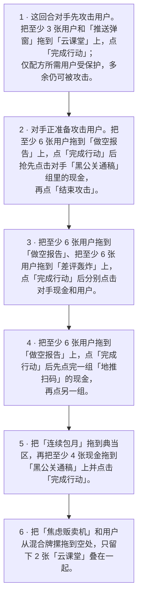


**自己经营 · 把前面学到的串起来**

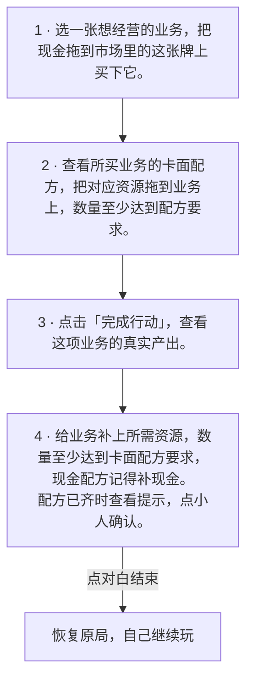


**每一步怎样带教与纠错**

教学允许玩家实际操作；非预期动作完成后自动撤销刚才这一手，并播放一次原有轻提示音。此前正确的中间进展保留，查看卡牌、展开牌摞和调整视角不算错误。拆除强化牌时，沿用牌桌“拖动所点卡及其下方牌”的操作，允许先拆出材料、再把所需资源补回业务；只有最终有效配方满足目标，才提示本步完成。撤销复用正式游戏的状态、攻击池和牌桌快照，恢复牌位、分组、资源和阶段；交易、结算与音效复用正式对局的实现。

普通生产、攻击配方的张数是最低需求，教程统一提示“至少 N 张”：例如云课堂需要至少 3 张用户，放入 8 张也有效。拆出单张、裂变缺料演示、保护配方与富余资源的对照仍使用明确数量，升级材料仍须精确张数。

组装顺序不限：可以先把用户与推送弹窗叠好，再整摞拖到云课堂，也可以把业务拖到材料摞上。准备摞可以拆开重组，富余资源和合法 Buff 不限制数量；是否能补成目标配方仍交给正式 `ComboRules` 判定，材料准备本身不算完成目标。会遭遇对手攻击的步骤提前说明攻击资源和保护范围；例如推送弹窗保护云课堂配方所需的 3 张用户，第 4 张仍可能被对手攻击。

配方尚未凑齐时，把现金放进需要用户的业务会撤销；已经能正常生效的组合仍允许富余资源和合法 Buff。玩家可以逐张或整摞移走错料，包括清掉最后一张，也可以把富余材料转给另一项业务。并行目标分别按各自核心旁的实际材料判断进展，不把同一组用户重复算给两项业务。

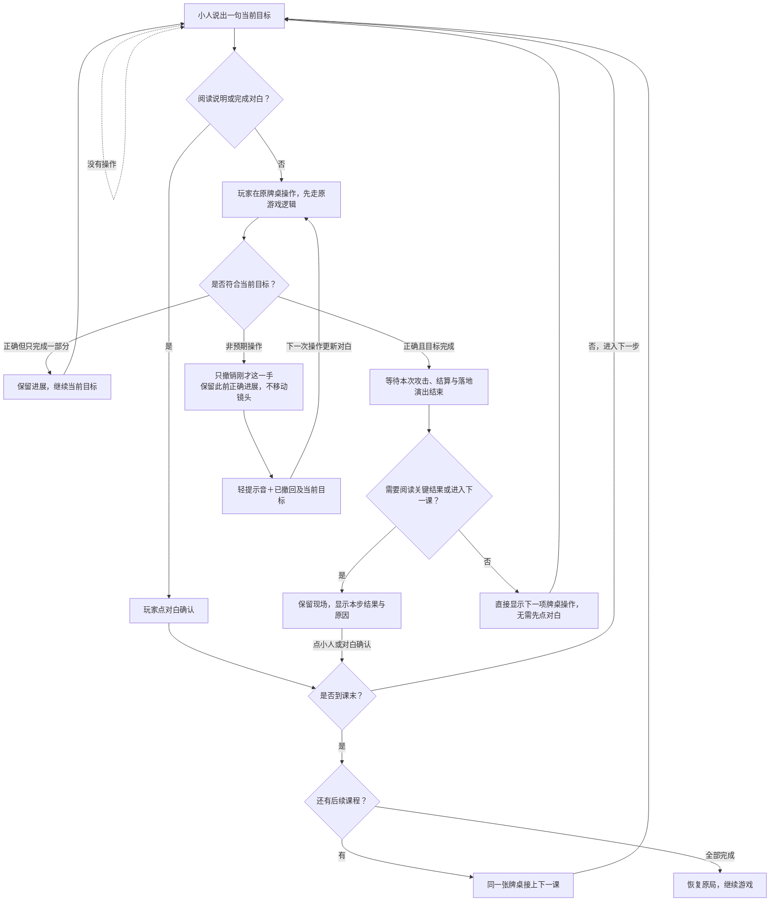

步骤的 `advance` 配置控制推进：`operation` 在本次成功操作及演出结束后直接衔接下一步，`confirm` 通过 `completion_goal` 回顾关键结果并等待点击。课程末步和阅读说明始终需要玩家确认；不按时间或普通界面刷新推进。15 个普通买牌、拆牌、配牌及进入攻击阶段的步骤直接衔接下一项操作；其余 27 步保留关键观察或课末确认。已有独立结果说明的首次收入、独角兽合成，在演出结束后直接进入原结果说明，避免重复确认。涉及结算时，先演完与正式对局共用的配方消耗、产出飞入和落地音效，等新卡落稳后才更新对白。攻击后的回顾解释保护、暴露或抢先打断的原因；现金保护同时区分受攻击损失和配方正常支付，不按固定数字描述损失。教程获胜时也复用正式胜负组件、动效与音效，到账与胜利展示结束后仍等待玩家点击继续。查看图鉴会暂停演出，退出或切课会取消旧演出。组合按真实规则和当前目标判断，示例张数不是唯一答案：多放资源或叠加合法 Buff，只要仍能完成目标就会保留。升级材料的精确张数等限制继续遵守正式规则。错误操作约 0.25 秒后回滚，回滚提示保留到下一次操作更新，不按计时自动换文案；没有操作时当前目标也保持不变。阅读说明通过点小人继续，最后的结束对白返回原局；教程中没有额外的「下一步」「更多」「演示」按钮。随时点「结束教程」、小人旁的退出按钮或按 Esc 均可恢复原局。

教程复用原有牌桌、相机和交互控件，小人对话作为浮层显示，不挤占牌桌区域，不自动移动牌桌或重置视角。使用标准卡表与固定教学局面，交易、编组、攻击及结算沿用正式裁决。进入练习时暂存当前单机局及原卡牌实体；退出恢复原卡表、资源、编组与操作状态，并保留玩家当前视角。单机对局可安全暂停时可以进入练习；联机和录像中可查阅卡牌总览和升级关系。学习进度保存在 `user://tutorial_progress.json`；继续未完成的课程从本课起点开始。

教学只负责配置起始局面、判断目标、推进课程和回滚非预期操作；玩法与表现从以下共用入口执行。修改正式玩法时应更新共用组件，不能在教程中复制一份简化实现。

| 内容 | 共用实现 |
| --- | --- |
| 买牌、典当、配方、升级、攻击及胜负裁决 | `IntentApply`、`GameState`、`ComboRules` |
| 拖拽、摞牌、拆牌、收摞、触屏长按及双指查看 | 原 `Board`、`TableTouchInput`；教程不另设手势 |
| 买牌付款、典当到账、余牌退回、组合消耗及产出落地 | `TableActions`、`CardMotion`、正式牌桌布局器 |
| 点击整摞挑靶、抓握撕牌、攻击音效与等待退场 | `TableActions`、`CardMotion.tear_batch`、原 `TableHands`；玩家和对手攻击均完整播放 |
| 卡牌护盾、Buff 光环及悬停效果说明 | 原牌桌的状态刷新、`CardEntity` 和 `Board` 说明逻辑 |
| 胜负面板、主题、尺寸、收放、动画暂停与释放 | `ResultPresentation` 与 `DrawerPresentation`；教程只提供播放结束后的续课回调 |

教程文案的参数统一由 `TutorialCatalog.format_text` 展开；数字和量词作为整体换行，避免“6张”被拆成两行，配置文件仍使用普通可读文字。发布包包含中文断词所需的 ICU 数据，避免编辑器排版正常、导出后却在空格处把“把”挤成独立一行；对话框沿用同一字体与断行规则测量，并微调宽度避免孤字尾行，不往文案插入硬换行。

所有新增邀请、课程名称、步骤目标、说明、提示和学习中心/图鉴用语集中在 `data/tutorial.json`。`ui` 管理通用文字，`courses` 管理课程与步骤，`scenarios` 管理固定练习局面。文案支持 `{win_cash}` 和 `{card.卡牌ID.字段}` 等占位符，实际卡名与数值由当前卡表展开。修改教学文字无需修改 GDScript；步骤判定和示例动作也保存在同一课程配置中。

卡牌总览按分类展示当前卡表全部卡牌，悬停即可查看效果说明。总览和升级关系直接展示正式 `CardEntity` 卡牌，复用桌面的卡面、配方、效果标记与插画动画；卡外不再添加框体、类别、价格或典当文字，也没有搜索框或点击详情页。升级关系按所需的真实张数叠放材料牌，用箭头连接合成后的牌，多个可选材料摞之间以“或者”连接。玩家看牌堆即可理解同名业务升级和业务合成传说，不需要先理解档位代号；路线仍由真实合成规则生成，未配置的升级不会出现在图中。

## 3. 文件目录结构

以下列出主要目录、配置、文档和操作入口，各模块内的源文件不逐一展开。

```text
.
├── data/
│   ├── tutorial.json           # 学习中心文案、课程目标与固定练习局面
│   ├── cards.json              # 卡牌、组合、升级和基础规则
│   ├── card_config_schema.json # 自定义卡表的可编辑字段、数值边界和固定规则
│   ├── ui.json                 # UI、配色、资源名称、音效映射
│   └── bot.json                 # BOT 与无头模拟参数
├── engine/                     # 规则、状态、结算、BOT、录像、配置与持久化
├── net/                        # 联机房间、传输、服务器和协议
├── scenes/                     # Godot 场景、牌桌、设置、规则书与 Web 文件交互
├── shaders/                    # 卡面和特效着色器
├── assets/                     # 随源码提供的卡面、图标、字体和音效
├── tests/                      # GDScript、Python、JavaScript 回归测试及夹具
├── tools/                      # 构建、检查、模拟、调参、发布和诊断工具
├── project.godot               # Godot 项目设置
├── export_presets.cfg          # macOS、Web、Android APK/AAB 导出预设
├── README.md                   # 项目说明、玩法、操作入口和许可说明
├── LICENSE                     # AGPL v3 标准许可证全文
├── NOTICE                      # 项目来源与许可标识
├── balance.md                  # 平衡分析和具体数值说明
├── bot.md                       # BOT 实现与评估说明
├── 构建游戏.command            # 构建 macOS App / Android 包
├── 启动游戏.command            # 启动已构建 App
├── 安装安卓构建环境.command    # 安装 Android SDK、JDK 和导出模板
├── 打包DMG.command             # 将已编译的 macOS App 制作成 DMG 安装盘
├── 本地运行Web版.command       # 本地启动 Web 版及联机服务
├── 打包发布.command            # 导出并生成 Web、macOS 发布压缩包
└── 启动手动调参.command        # 启动卡表调参与评估工作台
```

`assets/art/` 的卡面与角色图、`assets/android/` 的图标与启动图均由 Git 管理，克隆仓库即包含运行所需素材。素材旁的 `.import` 文件保存 Godot 导入设置与资源标识，应随素材提交；`.godot/` 中的导入缓存由 Godot 重新生成，不提交。构建输出和本地用户存档也不作为源码提交。

单机牌桌和无头 `Transport` 使用 `engine/round_flow.gd` 编排攻击、生产与回合收尾；牌桌通过回调插入输入和演出，裁决统一经过 `IntentApply`。联网客户端消费服务器结果，回执被拒时保留阶段并恢复输入。重开、切局与退出会使旧会话失效，旧的思考、网络和动画回调不能推进新局。

配方预览、付款和归零保护读取同一组合评估结果；自动整理只改变视觉归堆，组合关系、配方进度和 Buff 状态由界面展示。战报保存规则事件和资源结果，显示名称由当前界面生成。

`tmp/`、`tools/` 和 `tests/` 用各自的 `.gdignore` 排除 Godot 编辑器扫描，避免生成临时图片的 `.import` 和开发、测试脚本的 `.uid`。`tools/` 与 `tests/` 的纯 GDScript 脚本仍可在本项目使用的 Godot 4.7 中通过 `--script` 按路径运行，JSON 夹具直接按文件读取；这些目录不应放游戏运行时需要的导入资源或全局 `class_name`。正式游戏脚本与着色器的 `.uid` 是资源稳定标识，应继续保留并提交。

## 4. 构建、打包、测试

以下命令默认在仓库根目录执行。Godot 路径可用 `GODOT=/path/to/Godot` 覆盖。首次用 Godot 打开工程或运行构建入口时，会导入仓库内的素材并生成本地缓存。

### 4.1 构建和启动 macOS 版

```bash
./构建游戏.command
./启动游戏.command
```

启动脚本发现 `build/牛马牌.app` 不存在时会先构建。常用参数：

```bash
./启动游戏.command --rebuild       # 重新构建后启动
./启动游戏.command --rebuild "--cards-config=/absolute/path/cards.json" # 指定卡表试玩
./启动游戏.command 2                # 启动两个独立窗口
./启动游戏.command 2 --room=TEST    # 本机开房并让其余窗口加入同一房间
```

构建脚本还支持：

```bash
./构建游戏.command --help
./构建游戏.command --engine-plan
./构建游戏.command --slim-engine
./构建游戏.command --slim-engine --arch arm64 --jobs 8
```

`--engine-plan` 只扫描精简引擎计划；`--slim-engine` 会构建精简模板并导出 App。构建日志保存在 `build/logs/`。

制作 DMG 安装盘：

```bash
./打包DMG.command
./打包DMG.command --app "/path/to/牛马牌.app" --output "/path/to/牛马牌.dmg"
```

默认读取已编译的 `build/牛马牌.app`，输出 `build/牛马牌.dmg`。双击 DMG 后，将应用拖到盘内的“Applications”入口即可安装。打包过程保留 App 的权限和符号链接，校验新镜像成功后才替换已有安装包；日志保存在 `build/logs/`。

### 4.2 Android

先安装匹配 Godot 版本的 Android 依赖：

```bash
./安装安卓构建环境.command --dry-run
./安装安卓构建环境.command
```

导出包：

```bash
./构建游戏.command --android-debug   # debug APK
./构建游戏.command --android         # release APK
./构建游戏.command --aab             # Google Play AAB
```

首次构建发布包且未配置签名时，脚本会用 JDK `keytool` 生成独立的 release keystore，保存在项目的 `.android-signing/`（密钥和密码配置均不进 Git）。后续 APK/AAB 复用同一签名；请备份整个目录，清理 `build/` 或 `.godot/` 不影响它，换电脑构建时需一起迁移。

已有发布签名时，可在 Godot 对应 Android 导出预设中填写 `Keystore / Release`、`Release User`（密钥别名）、`Release Password`，或设置 `GODOT_ANDROID_KEYSTORE_RELEASE_PATH`、`GODOT_ANDROID_KEYSTORE_RELEASE_USER`、`GODOT_ANDROID_KEYSTORE_RELEASE_PASSWORD` 环境变量。脚本优先使用这些配置；配置缺项或密钥文件丢失会提前报错，不会生成新密钥替换。密钥密码和密钥库密码须一致。已有发行版本应继续使用原签名。

APK 导出后会用 `apksigner verify` 验证签名，通过后才替换最终产物，避免失败导出留下未签名包。Android 使用完整横屏牌桌，不使用 macOS 桌面抽屉模式。

Android 包名为 `com.astra.niumacard`，APK 和 AAB 使用同一包名。

#### Android 真机调试

首次安装完成后，先加载工具链环境并确认手机已连接：

```bash
source build/android-env.sh
export PATH="$ANDROID_HOME/build-tools/36.1.0:$PATH"
adb devices -l
```

手机端开启“开发者选项 → USB 调试”，用数据线连接并解锁手机；第一次连接时在手机上允许 USB 调试授权。当前 debug APK 是 `arm64-v8a`，测试设备需要支持 ARM64。

安装、启动和查看日志：

```bash
./构建游戏.command --android-debug
adb -d install -r build/牛马牌-debug.apk
adb -d shell monkey -p com.astra.niumacard 1
adb -d logcat -c
adb -d logcat | tee build/logs/android-device.log
```

如果新包名的版本仍提示签名冲突，确认不需要其本地数据后，执行 `adb -d uninstall com.astra.niumacard` 再安装；卸载会删除该应用的本地数据。停止日志用 `Control+C`。没有设备连接时，构建仍可完成，但不能做真机验证；`adb devices` 显示 `unauthorized` 时，需要回手机确认授权，显示 `offline` 时重新插拔数据线或重启 adb。

### 4.3 Web 与发布包

```bash
./打包发布.command
./本地运行Web版.command       # 本地单机 Web
./本地运行Web版.command 2     # 启动专服并打开两个联机标签
```

`打包发布.command` 固定生成 `build/牛马牌_web.zip` 和 `build/牛马牌_mac.zip`，首次运行可能需要下载 Godot Web 导出模板；下载和解压通过完整性验证后才安装，失败可直接重试。Web 版必须通过本地 HTTP 服务访问，不能直接双击 `index.html`。

项目不再手动设定应用版本，产物文件名也不带版本后缀。平台要求的内部版本字段由 Godot 使用默认值填充。

Web 使用常驻完整牌桌，复用规则书、选项、静音和录像入口；卡表和录像通过浏览器文件选择导入，保存录像会下载 JSON。静音偏好会跨场景和启动保留。

同一工作区的构建资源事务互斥，字体子集化、导入、导出和恢复不会交叠。素材导入失败会保留错误输出并以失败退出。

维护素材时可继续使用 `tools/build_art.py` 和 `tools/build_android_icons.py` 等生成工具。修改后的素材、清单与对应 `.import` 导入设置一起提交到 Git，游戏构建和发布会使用仓库中的素材。

新版卡牌直接覆盖 `assets/art/icon/icon_*.png`，通过 `data/ui.json` 的 `art.illustrations` 登记。29 张功能卡使用透明手绘简笔画；现金牌用没有表情的单枚硬币与 ¥ 符号，用户牌用呆萌圆头、豆形身体和线条四肢的全身小人；两者均采用不规则墨线和奶油色填充。资源牌主图、配方和产出图标共用 `assets/art/icon/icon_cash.png` 与 `icon_user.png`，仅显示尺寸不同；对应 SVG 仅作为可编辑源稿；资源牌没有底部配方和产出，主图向下居中平衡留白。插画中的金币和用户统一参考这两份资源图标，人物姿势和情绪随场景变化；运行时没有另一套旧卡牌素材。素材由内置 ImageGen 生成，风格参考《Stacklands》的简洁手绘感觉，插画以关键物件和动作为主体，需要人物时使用无身份特征的圆头小人，完整生成提示词保存在 `build/art_generation/icon_prompts.json`。`tools/build_art.py` 重建素材时会保留新版图标和插画登记，不会将新版覆盖回旧线稿。

双击项目根目录的 `启动动画预览.command` 可独立打开动画验收窗口，不需要进入牌局。默认使用已构建的应用；也可用 `GODOT=/Applications/Godot.app/Contents/MacOS/Godot ./启动动画预览.command` 从源码运行。悬停页在左侧选择全部 31 张牌（支持方向键切换），右侧展示正式卡面，鼠标移入播放、移出还原；撕牌页可选现金/用户、1～10 张及摞起/摊开，点击卡牌或播放按钮测试，并可反复播放。预览使用正式 `CardEntity`、`CardMotion.tear_batch` 与 `TableHands`，不启动 AI、联网或修改玩家存档。

悬停配置集中在 `data/ui.json.art.hover`。正式 31 张牌的静止 icon 和动画统一为最长边 **384 像素**，连续包月保持非正方形比例；1418 个显示帧仍按 12 fps 播放。动画用 `assets/art/icon/hover/<卡牌 ID>.hdelta` 保存无损帧间差分，恢复后的每一帧与缩小后的完整画面逐像素一致。首帧、起始停顿和循环回位共用对应静止 icon，不重绘动作、不改变帧序或时长。高清制作稿、完整 PNG 候选与转换记录仅存放于忽略的 `build/art_generation/`，正式素材没有另一套高清动画副本。广告投流、焦虑贩卖机、推送弹窗的语义修正及各牌动作保持已制作版本。
资源牌由 `tools/render_resource_hover.gd` 从已有完整 SVG 源稿绘制；云课堂使用 `tools/render_cloud_hover.py`；第一批五张使用 `tools/render_hover_batch01.py`；其余 23 张使用 `tools/render_hover_group_a.py`、`tools/render_hover_group_b.py` 和 `tools/render_hover_group_c.py`。这些工具在固定画布内绘制活动姿态，补齐遮挡后显露的背景，导出完整 PNG；没有运行时部件运动或混帧。候选先写入忽略的 `build/art_generation/`，通过检查后由 `tools/install_native_hover.py` 统一登记到 `data/ui.json`。正式安装经 `tools/pack_hover_animations.py` 用 Godot cubic 缩到 384 后编码并校验差分包；正式目录只留每牌一个 `.hdelta`。制作工具读取高清归档，不以 384 成品作为重绘底稿。

卡牌创建时只读静止图，悬停时后台解压差分、校验每帧 SHA256 并生成 mipmap，主线程分批上传。缓存最多保留三套并受 96 MiB 预算约束；移开可取消尚未使用的结果，退出回收后台任务。缩小采样图在运行时生成，不为每帧重复存入安装包。播放器支持不同帧数、循环停顿及一次播放后保留终态。拖动、翻面、移开、撕毁都会停止动作并恢复原图；配方、产出和价签继续共用静态资源图标。

游戏内“选项 → UI → 卡牌插画速度”可在 0.5×～2.0× 之间调节，默认 2.0×。拖动后立即从当前进度改变速度，无需重新悬停；底部“保存”记住下次启动设置，“还原默认”立即恢复配置默认值。默认倍率由 `data/ui.json.defaults.hover_animation_speed` 提供，范围与步长由 `controls.hover_animation_speed` 提供。此项仅控制悬停插画。独立动画预览使用同一配置的默认值和范围，调速单独生效，不写入游戏偏好。

`启动动画预览.command` 提供全部 31 张卡牌、0.5×～2.0× 播放速度、¼ 慢放、暂停与逐帧时间轴、原图对照和重播，也可切换到一次撕开多张牌的攻击检查。左侧“插画分辨率”显示实际尺寸；正式原图现为 384，选择 512/768/1024 会明确保持原尺寸、不放大，256 档可继续比较缩小效果。暂停后切换可对照同一帧；预览保持卡面显示大小、动作进度与 mipmap 过滤，不修改正式素材。准备过程中保留当前画面，换牌或换档会丢弃旧请求，侧栏操作期间保留当前动作。播放速度默认 2.0×，拖动后从当前进度立即生效，换牌与重播保留所选速度；¼ 慢放按所选倍率的四分之一播放，底部显示实际倍率。[anime.md](anime.md) 记录完整动作方案与执行状态。制作候选和源图备份在 `build/art_generation/`，像素回归、关键帧与实际应用检查记录在 `build/animation_checks/`。可用 `CARD_PREVIEW_BATCH=baoyue,pinshaoshao,shuabuting,ditui,waimai ./启动动画预览.command` 只看第一批，普通预览列出全部卡牌。

游戏区域的光标使用奶油色填充和深墨线简笔手，指向合法攻击目标时呈现愤怒手势。一次攻击的受击卡先抓成一叠，再由一双手同时撕开；玩家、AI、联机和录像共享整批演出，一批只响一次撕纸声，张数不增加动画次数。悬停介绍不重复展示插画，采用卡名、趣味说明、实体进度、配方/效果/典当两列信息和补充规则。

底板按功能分色：现金为黄、用户为蓝、变现为草绿、拉新为较深的蓝、传奇为白金、攻击为橙、增强为紫、防御为灰绿。卡面、卡背及典当行的全部运行时颜色均由 `data/ui.json.palette` 提供，通过现有 `Palette` 取色、保存、恢复和广播刷新；素材清单不再保存这些颜色。

牌桌使用暖灰绿再生纸纤维、低对比折痕，以及用户追钱、摸头、抱金币、被现金砸哭和被张嘴金币追赶等简笔画的较密的无缝重复墨线纹理（`assets/art/table/user_cash_pattern.svg`）；配合带折角的手绘理牌垫；理牌垫保持空净，双方身份由顶栏说明。购牌区采用纸板长条和固定手绘卡槽，典当行以短线分隔。价格以一端收尖、带圆孔与细绳的五边形长吊牌挂在卡牌右下角，金币图标共用现金牌贴图，图标与数字按实际绘制尺寸组成紧凑居中的价格行，统一留白。商品悬停时卡牌和吊牌一起轻抬，足额现金拖入时价签边缘反馈，成交时吊牌轻弹淡出。价格牌本体可以点击购买，绳线和圆孔仍只是装饰；付款和购牌限制由原游戏规则统一判定。所有颜色仍由现有 `Palette` 配置及取色逻辑提供。

选项菜单中的“UI”统一收纳显示与配色设置。“UI → 配色 → 背景纹理”可实时调整密度、图案间隔及纹理颜色；密度越大则重复次数越多，间隔控制平铺单元的额外留白。默认值在 `data/ui.json.palette.pattern`，与现有配色共用保存和还原逻辑，保存至 `user://palette.json`。

状态覆盖图直接维护在 `assets/art/overlay/overlay_shield.png` 与 `overlay_void_stamp.png`：护盾使用粗墨线浅蓝盾牌及奶油色勾，位于标题带下方；作废框中心透明，与独立文字一起倾斜，颜色跟随 `Palette.semantic("danger")`。两张图由内置 ImageGen 重绘，提示词记录在 `build/art_generation/overlay_prompts.json`，旧素材重建会保留已登记的新版。

游戏图标使用用户牌同款全身小人，姿势为无辜地抬手摸头。可编辑源稿为 `assets/art/app_icon.svg`；运行 `Godot --headless --path . --script tools/export_app_icon.gd` 导出 `assets/art/app_icon.png`、`assets/app_icon.png`，再运行 `python3 tools/build_android_icons.py` 更新 Android 图标和启动图。已采用差分动画的现金/用户牌由完整动画制作和安装流程成套更新静止图，导出应用图标时不会单独覆盖它们。游戏标题、抽屉角色、结算界面与各平台应用图标共用这套形象。

用 `Godot -s tools/visual_preview.gd -- --render /绝对路径/cards.png` 查看正式卡面的七卡样张；末尾加 `--all` 可查看全套卡牌。卡面仅保留卡名、插画与资源数值，按“配方 → 结果”排列；用途和消耗规则放在悬停说明，显示当前材料缺口、有效产出及资源消耗时机。插画事件动作和生产、升级、攻击回执共用真实对局结果，仅作用于表现层。

### 4.4 联机专服

```bash
"$GODOT" --headless -s tools/pvp_server.gd --port=8910
"$GODOT" --headless -s tools/pvp_server.gd --port=8910 --seed=12345 --verbose-net
```

服务器启动后会打印本机和局域网连接地址。客户端使用相同房间码连接；`--seed` 仅用于复现牌序，`--verbose-net` 用于查看网络收发。

### 4.5 测试

运行全部回归测试：

```bash
tools/run_tests.sh
```

入口自动发现 `tests/test_*.gd` 和 `tests/test_*.py`，再执行文档/脚本静态检查；
手动调参的 Python 测试包含 Node 网页行为回归。需要 Python 3、Pillow、fonttools、numpy、Node.js
和匹配项目版本的 Godot。报告分别统计 GDScript 断言、Python 用例和静态检查，跳过用例单独列出。
Python 依赖可在虚拟环境中用 `pip install -r requirements-test.txt` 安装。
测试分层、公共夹具和覆盖边界见 [测试说明](tests/README.md)。

只运行匹配名称的测试：

```bash
tools/run_tests.sh arrivals
TEST_SPEED=1 tools/run_tests.sh
tools/run_tests.sh android_signing
tools/run_tests.sh --suite drawer --list
tools/run_tests.sh --suite bot --suite network
JOBS=4 TEST_TIMEOUT=180 tools/run_tests.sh --log-dir build/test-results/local
```

筛选没有匹配项时返回失败。每个测试默认最多运行 180 秒，超时或取消会停止其进程与子进程；
详细日志和 `results.json` 保存在打印出的 `build/test-results/` 目录。每个 Godot 进程使用临时
项目入口和独立用户数据目录，Python 测试启动的游戏进程也继承此隔离，不覆盖玩家设置。
并行测试前会串行导入 Godot 资源并复用构建资源锁，修复首次运行或丢失的缓存；
导入失败单独记录在准备日志中，用例记为未运行。`--list` 和纯静态检查不会启动 Godot。

构建、测试和评估报告中的项目文件路径以项目根目录为基准，家目录内的其他位置显示为 `~/…`。
工具输出与归档日志会移除本机项目目录和家目录前缀；SDK 和签名配置仍保留实际运行所需的路径。

单独运行某个 GDScript 测试：

```bash
"$GODOT" --headless -s tests/test_engine.gd
```

直接单跑时，继承 `tests/harness.gd` 的测试也会隔离 `user://`；完整超时、日志和子进程
清理请使用统一入口。

常用静态检查和发布验证：

```bash
python3 tools/check_card_table.py
python3 tools/check_doc_refs.py
python3 tools/check_card_values.py
python3 tools/check_art_assets.py
python3 tools/verify_release.py build/牛马牌.app
```

无头对局和手动数值评估：

```bash
"$GODOT" --headless -s tools/balance_report.gd 500 baseline
./tools/bot_duel.sh 50 bot:1 bot:0 1001 tmp/bot-duel.json
# 推荐：双击项目根目录「启动手动调参.command」
# 命令行评估：tools/eval.sh /absolute/path/manual-request.json
```

手动调参工具支持同时提交多项评估，每项使用独立 Godot 进程，保存自己的进度、卡表快照和逐局数据。在“评估记录”的对应行点击“停止模拟”，只停止该项任务。“保存并运行当前配置”左侧的“仅保存配置”只保存当前配置及备注，不启动模拟或游戏。名称和卡牌参数均未修改时复用原配置；创建新配置需要未使用的新名称和修改后的卡牌参数，保存、评估与试玩沿用同一套配置校验。指标口径与使用方式见 `balance.md`。

测试和检查均以退出码表示成功或失败；出现空输出时应继续查看脚本退出码、日志和对应测试文件，而不要据此判断“没有问题”。

## 5. 使用许可

本项目采用 [GNU Affero General Public License v3.0](LICENSE)，仅第 3 版（`AGPL-3.0-only`）。许可证使用 [SPDX 收录的标准全文](https://spdx.org/licenses/AGPL-3.0-only.html)，未添加额外限制。以下为使用说明，具体权利和义务以 `LICENSE` 为准。

- **允许商用**：可按许可证使用、修改和分发本项目，包括商业用途；遵守 AGPL v3 不需要另行购买商业授权。
- **分发与源码**：分发时须保留适用的版权、许可和免责说明，附上许可证，并按条款提供相应源码。分发受许可约束的修改版本时，须说明修改情况并继续遵守 AGPL v3。
- **网络交互**：如果修改本项目并让用户通过网络与修改后的版本交互，须按第 13 条向这些用户显著提供免费获取该版本相应源码的途径。
- **项目来源**：[NOTICE](NOTICE) 记录项目名称“牛马牌（useup_money）”和原仓库链接，不增加标准许可证之外的使用限制。

项目自有源文件使用以下简短声明，注释符号按文件语言调整；可执行脚本的 shebang 保留在首行：

```python
# Copyright (C) 2026 etali (https://github.com/etali)
# SPDX-License-Identifier: AGPL-3.0-only
# See LICENSE in the project root.
```

本许可仅适用于维护者有权授权的项目内容。Godot 引擎、Noto 字体及其他第三方代码或素材继续适用各自的许可证；其中 `assets/fonts/NotoSansSC.ttf` 适用 SIL Open Font License 1.1。

选项面板统一位于顶部横条下方的右上角，并限制在上下横条之间；长内容使用内部滚动（读入录像与局域网对战保留独立流程）。保存录像后的结果与可复制路径留在原“存录像”页。

UI 页底部统一提供“保存”和“还原默认”，作用于窗口比例、透视、牌桌缩放、入口大小、配色与背景纹理。默认窗口比例为工作区的 98%；已保存的比例仍按个人设置读取。显示偏好写入 `user://ui_preferences.json`，配色沿用 `user://palette.json`；下次启动读取。独立的“还原全桌”按钮已移除。价签与牌角分开留白，绳环连接卡角绳结和吊牌圆孔。
